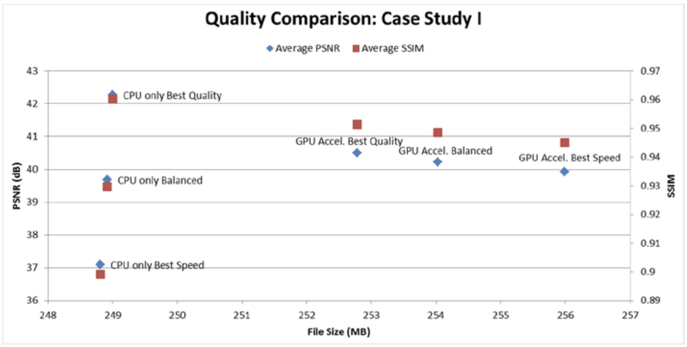
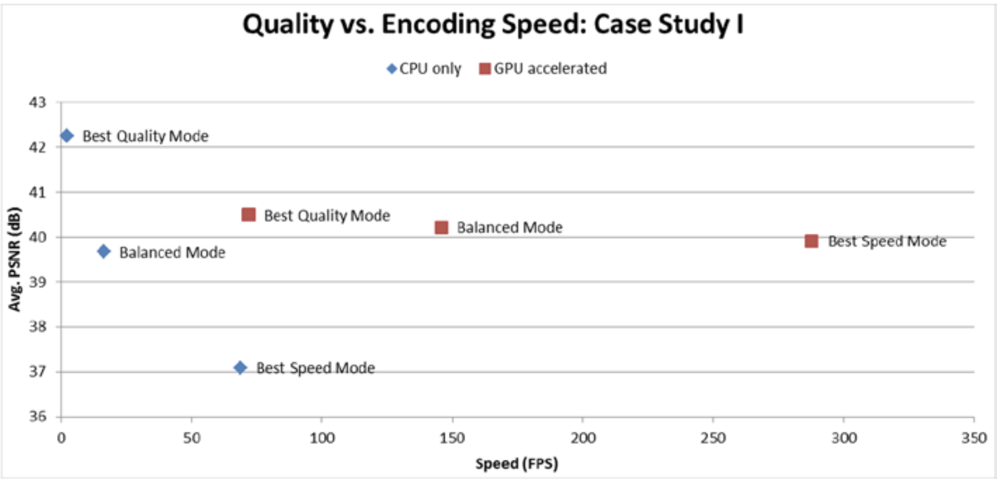

# Case Study I
将一个35Mbps码率的H.264视频转码为相同格式、7Mbps码率的视频。原视频片长约5分钟，分辨率为1920×1080p，30fps。视频中包含几个不同复杂性的场景，从密集空间细节到大量平面区域，从不规则运动到静态镜头。转码中涉及将原文件全解码并用新编码参数对其进行重新编码。

转码的采用的计算机平台配置如表8-3所示。

表8-3 案例I转码采用的计算机平台配置

|System Parameter|Configuration| 
|:--------|:--------|
| 处理器 |4th-gen. Core i5|
| 核数 |  4  |
|CPU主频| 2.9 GHz  |
|CPU睿频| 3.6 GHz |
|热设计功耗| 65 W  |
|缓存大小| 6 MB  |
|显卡| Intel (R) HD Graphics (TM) 4600|
|GPU最大频率|1.15 GHz|
|嵌入式DRAM |Yes|
|内存|4 GB双通道|
|内存频率|1333 MHz| 

转码采用了两种方式：仅运行在CPU上的软件转码器，和经过GPU加速的转码器（大多数计算密集型任务在专用硬件单元中完成）。这两种实现方式不同地优化了参数，但两者都提供了三种性能质量权衡的输出模式：最佳质量模式，平衡模式和最佳速度模式。

GPU加速的实现只提供了少量外部可设置的参数，而仅CPU上的转码有更多的可调参数，我们尽力使这些参数在各自的实现方式下尽可能接近。当然，两种实现方式的模式调整的确切参数存在差异，但也存在一些共性。表8-4总结了常用参数。

表8-4 两种转码方案的常用的配置

|参数|最佳质量模式|均衡模式|最佳速度模式|
|:--------|:--------|:--------|:--------|
| 运动估计和模型决策算法 | 算法1 | 算法2 | 算法3（早期版本中？） |
| 局部运动补偿 | 八分之一像素 | 四分之一像素 | 无 |
| 参考帧 | 多 | 少 | 1 |
| 自适应搜索 | 有 | 无 | 无 |
| 运动搜索范围 | 大 | 中 | 小 |
| 加权预测 | 有 | 有 | 无 |
| 多B帧？ | 有 | 有 | 无  |
| 子宏块分区 | 全部 | 部分 | 无 |
| 场景变化检测 | 有 | 有 | 无 | 
| 比特率控制的前向分析 | 多数帧 | 少数帧 | 无 |

请注意，这两种实现方式中使用的参数略有不同，因此也不会产生完全相同的视频质量。另外，GPU加速实现的重点是在不损失太多视觉质量的情况下获得更高的性能，因此在此实现中只有少数参数的调整是从最佳质量到最佳速度。 另一方面，仅CPU转码器中难以获得更高的性能，因此在该实现方式的最佳速度模式下更激进的关闭了几个功能（相比GPU加速转码器而言）。

以FPS来衡量两种转码器实现的三种操作模式的下的性能。注意，为获得性能质量的平衡，三种模式都调整了编码参数。 图8-5显示了仅CPU转码和GPU加速转码两种实现之间的性能比较，同时图中还显示了不同模式下的比率。


**图8-5.** 不同转码模式的性能对比

从图8-5可以看出，这两种实现都在速度方面进行了缩放，速度范围从最佳质量到平衡模式再到最佳速度模式。例如，GPU加速将编码从一种模式加速到另一种模式，速度提高了大约2倍。但是，由于对编码参数进行了更积极的调整，仅CPU的方式从最佳质量缩放到了平衡模式，并且利用表8-5中的优化措施实现了7.45倍的加速。类似的，从平衡模式到最佳速度模式，可获得额外的4.2倍加速。

**表8-5.** 不同模式下，仅利用CPU的优化方法

| 参数 | 最佳质量  | 平衡 | 最快速度 |
|:---|:---|:---|:---|
| Motion estimation method  | Uneven multihexagon search  | Hexagonal search with radius 2  | Diamond search with radius 1  |
| Maximum motion vector range  | 24  | 16  | 16  |
| Sub-pixel motion estimation  | Yes  | Yes  | No  |
| Partitions  | All (p8x8, p4x4, b8x8, i8x8, i4x4)  | p8x8, b8x8, i8x8, i4x4  | No sub-macroblock partitions  |
| Use trellis for mode decisions  | Yes  | No  | No  |
| Adaptive quantization  | Yes, with auto-variance  | Yes  | No  |
| R-D mode decision  | All picture types  | I-picture and P-picture only  | None  |
| Max number of reference pictures | 16  |  2 |  1 |
| Number of references for weighted prediction for P-pictures  |  2 |  1 |  None |
|  Number of frames to look-ahead | 60  | 30  | None  |
| Max number of adaptive B-pictures  | 8  |  2 |  None |
| CABAC  | Yes  | Yes  |  No |
| In-loop deblocking | Yes  | Yes | No  |
| 8×8 DCT  | Yes  | Yes  | No  |
| Scene change detection  | Yes  | Yes  | No  |

显然，如上的优化影响了视觉质量。图8-6显示了两种实现方式的视频质量的比较。从最佳质量到最佳速度，未利用GPU加速的方式的PSNR平均损失约5 dB，而文件大小的减少则不到0.1％。另一方面，在保持视觉质量的同时提高性能的焦点上，GPU加速的方式从最佳质量到最佳速度模式下仅平均损失了~0.6 dB的PSNR。但是，与最佳质量模式相比，采用最佳速度模式时，GPU加速的模式会导致文件大小增加〜1.25％，从而折衷了所获得的压缩量。

**图8-6.** 是否采用GPU加速模式的质量对比

从图8-5和图8-6还可以发现：就三种性能模式的速度而言，采用GPU加速比仅采用CPU时分别快约33倍、9倍、4倍。这也显示了两种实现之间在参数调整方面的对比。尽管GPU加速的实现在最佳质量模式下的性能要好得多，但与仅用CPU的最佳质量模式相比，它的PSNR平均降低了1.76 dB，文件大小增加了约1.5％。因此，GPU加速的方式已经在通过牺牲视觉质量而支持性能。此外，由于某些算法是在固定功能硬件单元实现的，因此，GPU加速的实现在更改算法的能力方面缺乏灵活性。尽管如此，在最佳速度模式下，GPU加速方式的PSNR平均高出约2.8 dB，但与纯CPU实现相比，文件大小却增大了约2.9％。这些结果证明了这两种实现中所固有的性能-质量折衷。

图8-7显示了本节的案例研究的编码视频质量与编码速度之间的关系。 对于CPU-only和GPU加速的不同模式下的质量/速度存在明显的缩放，但是两种实现方式的缩放率却是不同的。

**图8-7.** Case Study I 的质量和速度的比较


