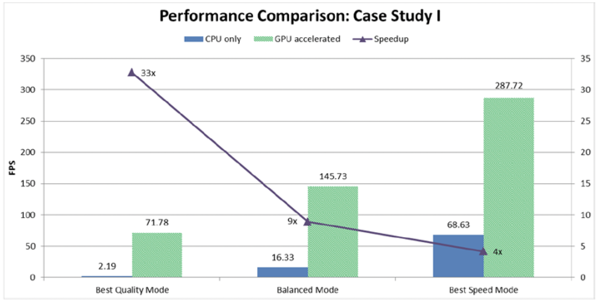

将一个35Mbps码率的H.264视频转码为相同格式、7Mbps码率的视频。原视频片长约5分钟，分辨率为1920×1080p，30fps。视频中包含几个不同复杂性的场景，从密集空间细节到大量平面区域，从不规则运动到静态镜头。转码中涉及将原文件全解码并用新编码参数对其进行重新编码。

转码的采用的计算机平台配置如表8-3所示。

表8-3 案例I转码采用的计算机平台配置

|System Parameter|Configuration| 
|:--------|:--------|
| 处理器 |4th-gen. Core i5|
| 核数 |  4  |
|CPU主频| 2.9 GHz  |
|CPU睿频| 3.6 GHz |
|热设计功耗| 65 W  |
|缓存大小| 6 MB  |
|显卡| Intel (R) HD Graphics (TM) 4600|
|GPU最大频率|1.15 GHz|
|嵌入式DRAM |Yes|
|内存|4 GB双通道|
|内存频率|1333 MHz| 

转码采用了两种方式：仅运行在CPU上的软件转码器，和经过GPU加速的转码器（大多数计算密集型任务在专用硬件单元中完成）。这两种实现方式不同地优化了参数，但两者都提供了三种性能质量权衡的输出模式：最佳质量模式，平衡模式和最佳速度模式。

GPU加速的实现只提供了少量外部可设置的参数，而仅CPU上的转码有更多的可调参数，我们尽力使这些参数在各自的实现方式下尽可能接近。当然，两种实现方式的模式调整的确切参数存在差异，但也存在一些共性。表8-4总结了常用参数。

表8-4 两种转码方案的常用的配置

|参数|最佳质量模式|均衡模式|最佳速度模式|
|:--------|:--------|:--------|:--------|
| 运动估计和模型决策算法 | 算法1 | 算法2 | 算法3（早期版本中？） |
| 局部运动补偿 | 八分之一像素 | 四分之一像素 | 无 |
| 参考帧 | 多 | 少 | 1 |
| 自适应搜索 | 有 | 无 | 无 |
| 运动搜索范围 | 大 | 中 | 小 |
| 加权预测 | 有 | 有 | 无 |
| 多B帧？ | 有 | 有 | 无  |
| 子宏块分区 | 全部 | 部分 | 无 |
| 场景变化检测 | 有 | 有 | 无 | 
| 比特率控制的前向分析 | 多数帧 | 少数帧 | 无 |

请注意，这两种实现方式中使用的参数略有不同，因此也不会产生完全相同的视频质量。另外，GPU加速实现的重点是在不损失太多视觉质量的情况下获得更高的性能，因此在此实现中只有少数参数的调整是从最佳质量到最佳速度。 另一方面，仅CPU转码器中难以获得更高的性能，因此在该实现方式的最佳速度模式下更激进的关闭了几个功能（相比GPU加速转码器而言）。

以FPS来衡量两种转码器实现的三种操作模式的下的性能。注意，为获得性能质量的平衡，三种模式都调整了编码参数。 图8-5显示了仅CPU转码和GPU加速转码两种实现之间的性能比较，同时图中还显示了不同模式下的比率。


**图8-5.** 不同转码模式的性能对比



