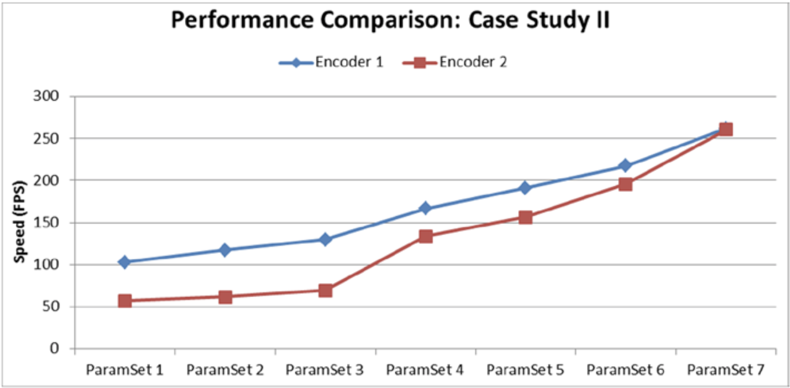
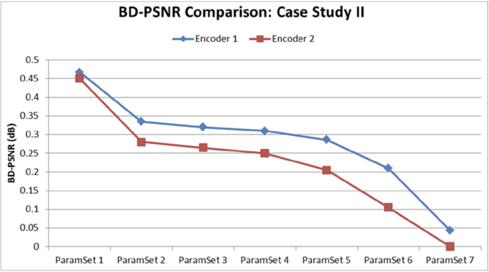
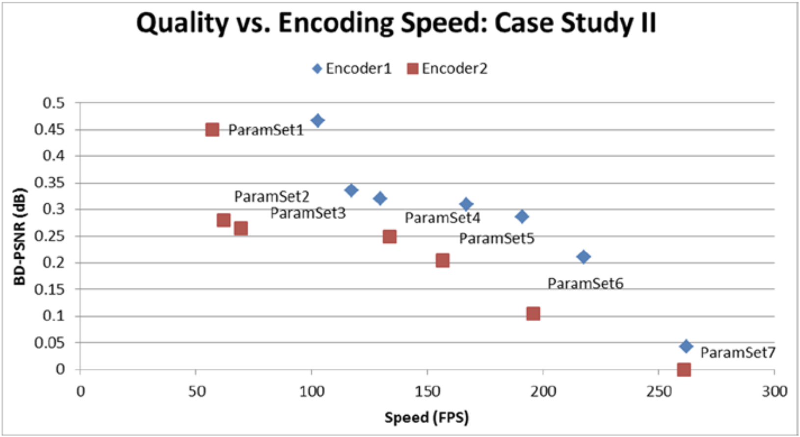

# Case Study II
第二个案例显示了两种编码解决方案在性能和质量方面的另一个比较。在该案例中，测试组的视频包含十种不同的视频内容，这些内容具有不同的运动和细节复杂性。视频分辨率均为：352×288，720×480，1280×720，1920×1080。采用七组视频编码参数用以涵盖从最佳质量到最佳速度的范围。使用两种GPU加速的编码器执行编码测试。

在此案例中，尽管编码器的参数集之间存在一些差异，但两种编码器都在相似的应用程序接口上运行，因此对于两种编码器而言：参数集1提供最佳质量，参数集7提供最佳速度。例如，编码器1的参数集1包括1/8像素精度的运动补偿并使用网格执行模式决策，而编码器2的参数中未包含这些参数设置。表8-6显示了两个编码器共有的一些重要参数。

**表8-6.** 两种编码器共有的重要参数

|   | PS1  | PS2  | PS3 | PS4  | PS5  | PS6  | PS7  |
|:---|:---|:---|:---|:---|:---|:---|:---|
| 8×8 transform  | Yes  | Yes  | Yes  | Yes  | Yes  | Yes  | Yes  |
| 1⁄4 pixel prediction  | Yes  | Yes  | Yes  | Yes  | Yes  | No  |   |
| Adaptive search  | Yes  | Yes  | Yes  | Yes  | Yes  | No  | No  |
| Max references  | 10  | 8  | 6  | 5  | 4  | 2  | 2  |
| Multiple prediction | Yes  | Yes  | Yes  | Yes  | P-picture only  | No  | No  |

图8-8显示了两个编码器在不同参数集上的FPS方面的性能比较。两种编码器随着参数集的调整，都有明显的性能提升的趋势。但是，不同编码器的速度提升率却是不同的。在参数集3之后，编码器2的最佳性能要比实时性能快~9倍。而编码器1通过调整参数可以达到大致相同的性能提升率。

**图8-8.** 两种编码器的性能比较

图8-9显示了在编码参数集上，两个编码器在BD-PSNR方面的质量比较。类似的，两个编码器都存在质量逐渐降低的明显趋势。对于编码器2，调整参数最多可获得〜0.45 dB的BD-PSNR增益，而编码器1则可达到〜0.47 dB。但是，对于编码器1，参数调整的中间级别不会显示出明显的质量差异。编码器1在参数集7和6以及参数集2和1之间均存在明显的质量提升。

**图8-9.** 两个编码器的质量比较

图8-10显示了第二个案例研究的质量与编码速度的关系。通常，对于所有参数集，对于给定的编码速度而言，编码器1可以提供更好的质量。显然，参数集1确实代表了最佳质量模式，而参数集7代表了两种编码器的最佳速度。对于编码器1，参数集6似乎是最有效的，因为它提供了最大的质量差异（〜0.1 dB BD-PSNR），而且与此同时，它的编码速度也比编码器2提高了11％以上。

**图8-10.** 案例研究II中的质量和编码速度的比较
