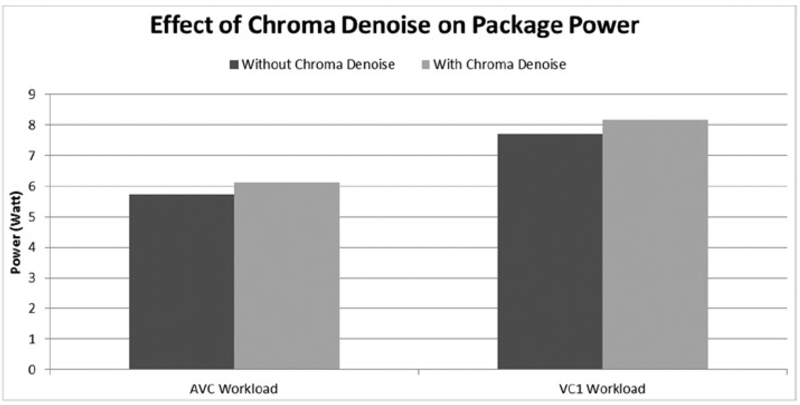
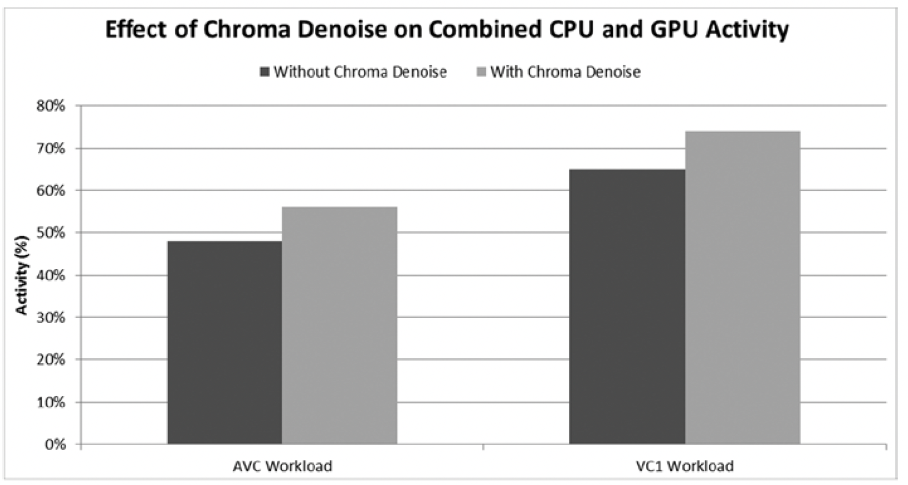
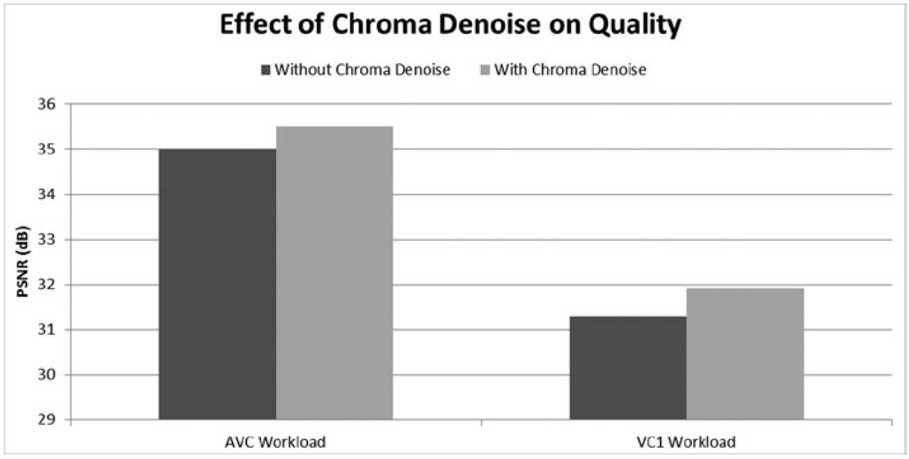
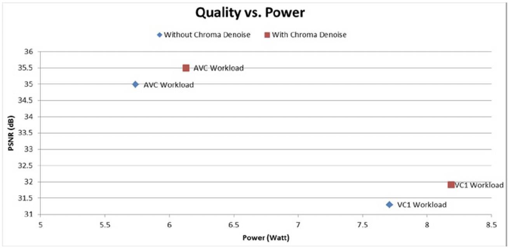

# 案例研究
本案例使用第三代Intel Core i7系统，CPU主频2.7GHz，最大睿频3.7GHz，热设计功耗45W，显卡最大动态频率1.25GHz。屏幕分辨率为1920×1080，与视频内容的分辨率相同。使用均衡的操作系统电源策略，工作温度保持在50°C（CPU风冷系统的常规运行温度）。采用两种工作模式，包括AVC编码的视频播放和支持色度去噪滤波器的VC-1编码蓝光光盘播放。注意，与AVC编码的内容相比VC-1编码的内容具有更高的场景复杂度。

图8-11显示了色度去噪滤波器对功率的影响。从功率的角度看，使用色度去噪滤波器带来了平均约7％的额外功率，约0.48瓦。这是一个明显的功耗。

**图8-11.** 色度去噪滤波器对功率的影响

图8-12显示了色度去噪滤波器对CPU和GPU的整体活动影响。从活动角度看，使用色度去噪增加了约8.5％的活动量。这与功耗的增加相对应，并且说明处理器的忙碌时间明显增加。

**图8-12.** 色度去噪滤波器对CPU和GPU的整体活动影响

图8-13显示了PSNR维度的色度去噪滤波器对视觉质量的影响（PSNR，Peak Signal to Noise Ratio，峰值信噪比）。 尽管有平均约0.56dB的PSNR的改善，但这些工作负载对视觉质量的影响很小。注意，VC1工作模式下的PSNR绝对值比AVC的低约4dB，原因是VC-1视频编码与AVC编码相比有更高的复杂性。

**图8-13.** PSNR维度的色度去噪滤波器对视觉质量的影响

图8-14显示了色度去噪滤波器功耗与质量的权衡。尽管可以观察到PSNR的改善，但是这种改善是以显著增加的功耗为代价的。因此在功耗有限的情况下应仔细权衡。例如，在检测到低电量时，可功率感知的回放程序将自动关闭色度去噪以节省功耗。

**图8-14.** 色度去噪滤波器功耗与质量的权衡